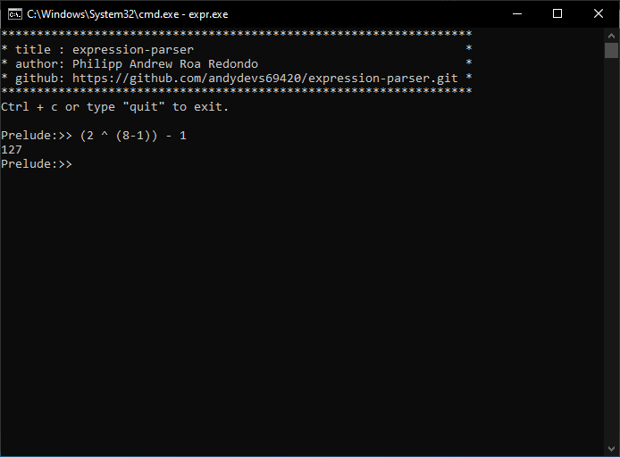
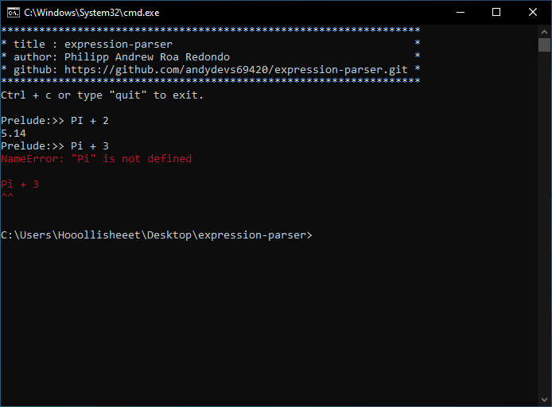
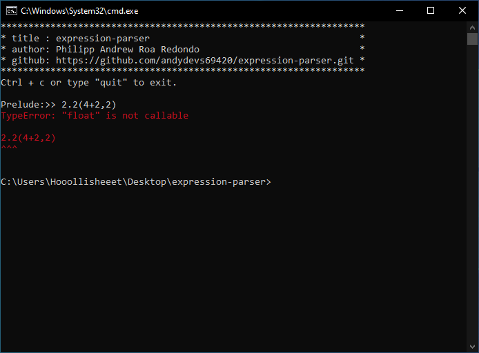
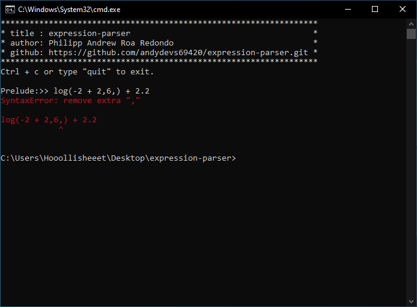
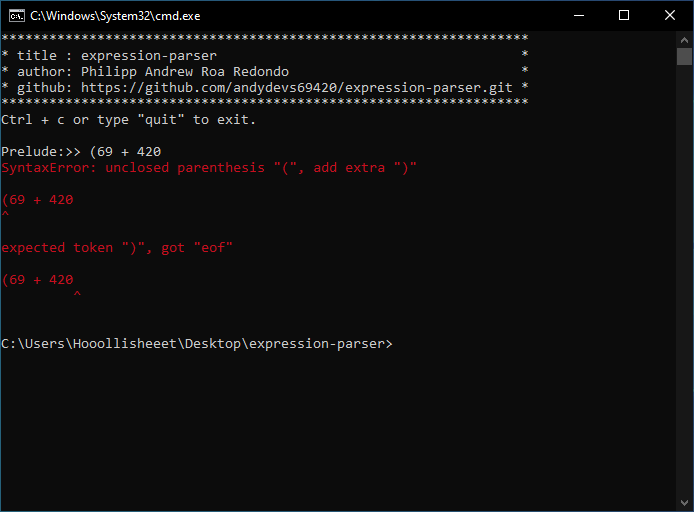

  <h1>expression-parser</h1>

**🔥 Description**  

A light weight expression parser written in C  
programming language.

**REQUIREMENTS**  
- gcc or msvc(experimental)

# 📷 SAMPLE SCREENSHOTS

  
  
  
  
  
  

